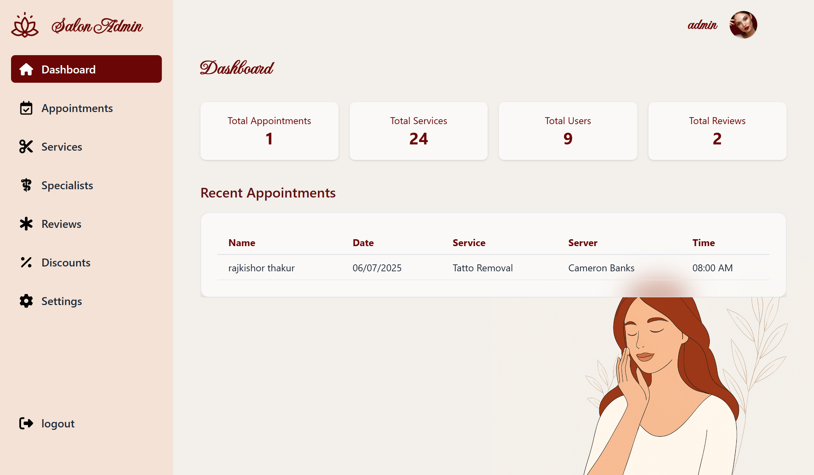
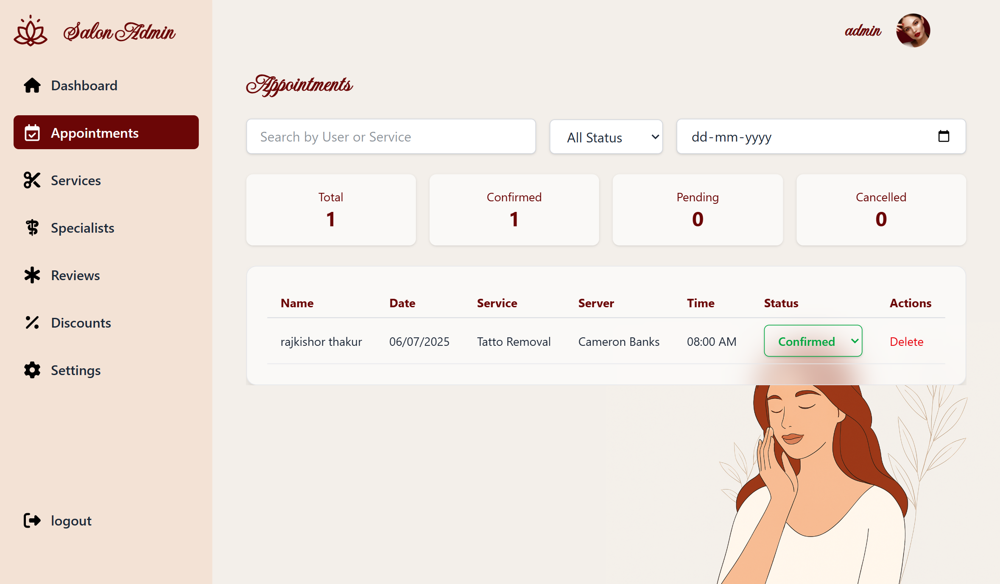
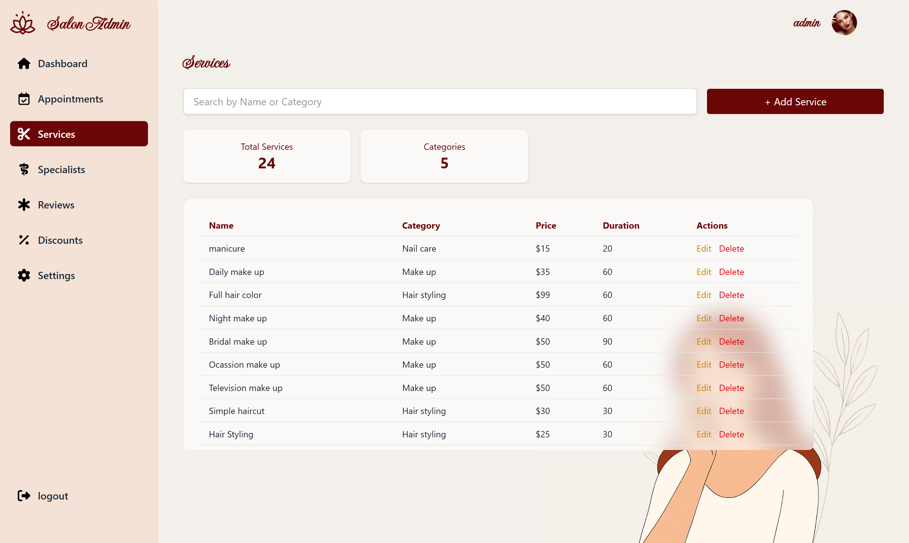
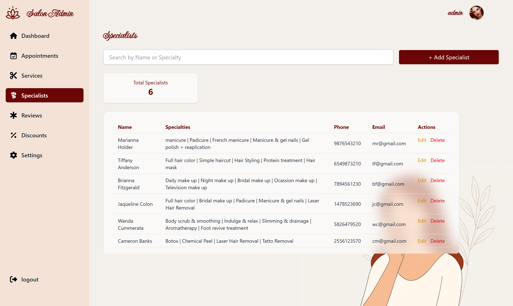
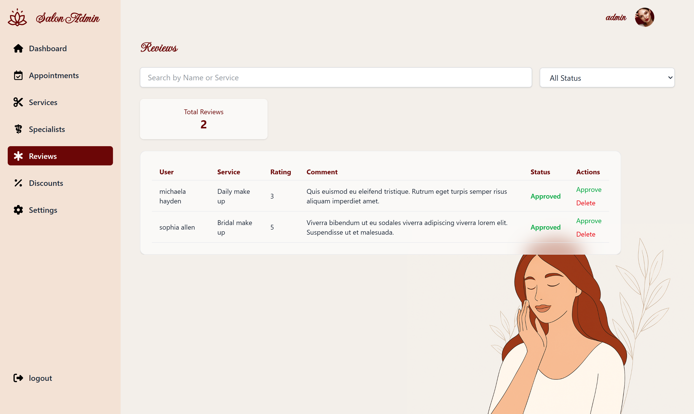
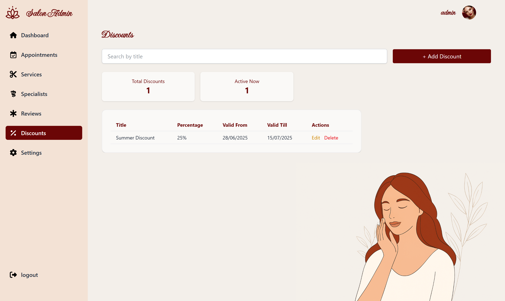
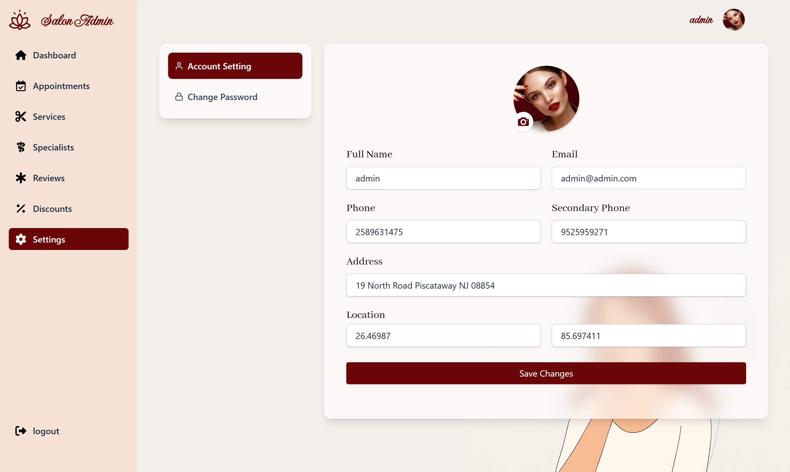

# 💇‍♀️ Beauty Salon — Fullstack Booking & Management System

A fully-featured fullstack Beauty Salon web application where users can explore services, book appointments with specialists, and admins can manage services, appointments, and customer interactions via a powerful dashboard.

> 🚀 Built with the MERN Stack (MongoDB, Express, React, Node.js) + Tailwind CSS

---

## 🌟 Features

### 👤 User Module

- Browse available services with prices

- Select specialist based on availability & service type

- Book appointments with real-time slot checking

- User authentication with JWT + Refresh Tokens

- Profile update with image upload

- Submit and view reviews

- Contact form with map location (OpenStreetMap)

- OTP Verifiaction via email while Signup

- Email notification on Appointment Status Change

### 🧑‍💼 Admin Module

- Secure login and protected dashboard

- View salon statistics (users, services, reviews, bookings)

- Manage Appointments with filtering and status update

- Manage Services (CRUD operations)

- Manage Specialists and assign expertise

- Approve/Reject Reviews

- Manage Discounts

- Manage Contact Information (Phone, Email, Address)

- Change profile and password

---

## 🛠️ Tech Stack

### 💻 Frontend

- React.js
- Tailwind CSS
- Redux Toolkit
- React Router DOM
- React Hook Form
- Axios
- React Toastify
- OpenStreetMap
- Cloudinary (Image Hosting)

### 🌐 Backend

- Node.js
- Express.js
- MongoDB + Mongoose
- JWT Authentication
- Multer (File uploads)
- Nodemailer (Email OTP, Password Reset)
- CORS, Cookie-Parser, Bcrypt

---

## 🔐 Authentication

- Access and Refresh Token mechanism

- Role-based authentication for User and Admin

- Persistent login using cookies and JWT

- OTP-based email verification for signup

- Password reset via email link

---

## 🔄 Project Structure

### 📁 Client

```
client/
├── public/
├── src/
│   ├── api/
│   ├── app/
│   ├── assets/
│   ├── components/
│   ├── constants/
│   ├── features/
│   ├── layouts/
│   ├── pages/
│   ├── routes/
│   ├── sections/
│   ├── utils/
|   ├── App.css
|   ├── App.jsx
|   ├── index.css
|   └── main.jsx

```

### 📁 Server

```
server/
├── public/
├── src/
│   ├── controllers/
│   ├── db/
│   ├── middlewares/
│   ├── models/
│   ├── routes/
│   ├── utils/
│   ├── app.js
│   ├── constants.js
│   └── index.js
```

---

## 📸 Screenshots

### User Side

> 🏠 Home Page

- 

> 💅 Service Page

- 

> ℹ️ About Page

- 

> 📞 Contact Page

- 

### Admin Dashboard

> 🏠 Dashboard

- 

> 📅 Appointments

- 

> 💇‍♀️ Servies

- 

> 👨‍⚕️ Specialists

- 

> ⭐ Reviews

- 

> 💸 Discounts

- 

> ⚙️ Settings

- 

---

## 🚀 Live Demo

🔗 [Visit Live App](https://beauty-salon-gamma-azure.vercel.app/)

---

## 🧪 Testing

- Manual testing of all user flows

- Form validations and error handling

- Responsive UI across devices

- Edge cases handled (token expiry, no slots, invalid input)

---

## ⚙️ Environment Variables

### Frontend `.env`

```
VITE_API_BASE_URL=your_backend_link
```

### Backend `.env`

```
PORT=8000
NODE_ENV=production
FRONTEND_URL=your_frontend_url
MONGO_URI=your_mongodb_uri
ACCESS_TOKEN_SECRET=your_access_token_secret
ACCESS_TOKEN_EXPIRY=your_access_token_expiry
REFRESH_TOKEN_SECRET=your_refresh_token_secret
REFRESH_TOKEN_EXPIRY=your_refresh_token_expiry
RESET_PASSWORD_SECRET=your_reset_password_secret
CLOUDINARY_CLOUD_NAME=your_cloud_name
CLOUDINARY_API_KEY=your_api_key
CLOUDINARY_API_SECRET=your_api_secret
EMAIL_SERVICE=gmail
EMAIL_USER=your_email@gmail.com
EMAIL_PASS=your_app_password
```

---

## 📦 Install & Run Locally

```bash
# Clone the project
git clone https://github.com/rajkishort596/Beauty-salon.git
cd Beauty-salon

# Backend setup
cd server
npm install
npm run dev

# Frontend setup
cd client
npm install
npm run dev
```

---

## 🧠 Future Improvements

- Google/Facebook OAuth

- Stripe Integration for Online Payments

- Multi-language Support

- Advanced Calendar for managing slots

---

## 🙏 Acknowledgements

- Design inspired by Figma Guru
  🔗 [Figma Design](https://figma.guru/websites/beauty-salon-figma-template/)

- ChatGPT and GitHub Copilot for rapid prototyping

---

## 📜 License

This project is licensed under the MIT License.

---

## 👤 Author

Made by **Rajkishor Thakur**

---
